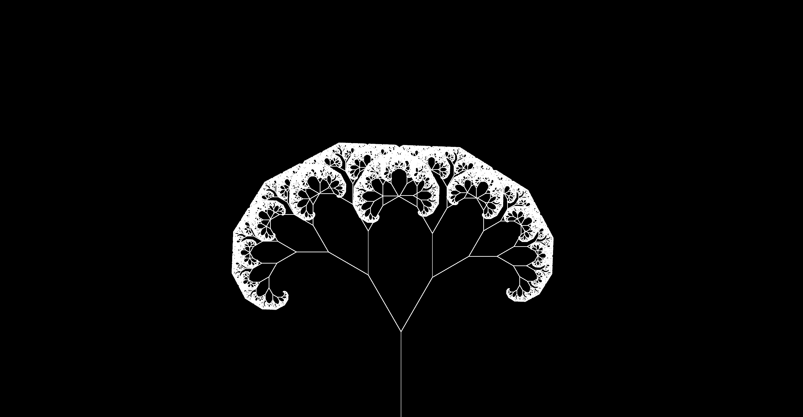
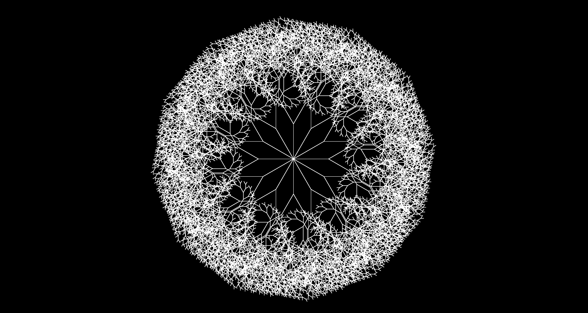

For this project, I produced a series of generative works. My plan at the start of the project was to
develop simple algorithms built around vectors and grids, then let them evolve functionally or
aesthetically across each iteration. My inspiration comes from Casey Reas’ *Process* series and early generative artists such as Georg Nees and Frieder
Nake. I wanted to create computer driven works that feature emergence.
I was able to develop pieces
with minimal user interaction where randomness and unpredictable outcomes play a central
role. The project splits into two sections. The first explores grids, and the second focuses on
vectors.

I began with the grid. This work is inspired by François Morellet’s *4 Grids 0° 22.5°
-45°
-67.5°*
(1958). In that early generative piece, Morellet plotted four grids at four different rotations,
creating ornamental polygonal shapes that almost become circular in certain areas. I recreated
his setup by generating four grids at the same angles, then pushed the idea forward by having
them rotate – two clockwise, two counterclockwise – around the center. As they move, the
overlapping lines generate shifting polygons and a pulsing of plaid-like squares that change
size.

Click the thumbnail to watch! ***Make sure video quality settings are set to 1080p60 HD.***

In the next iteration, I kept the same set of grids but added oscillation to the spacing between
the horizontal and vertical lines. The plaid-like pulsing from the first example is still there, but
now it seems to rotate and jump around the composition, almost like shifting from one spot to
another on a map. When the spacing gets very small, it resembles TV static and the squares
appear to spin.

Click the thumbnail to watch! ***Make sure video quality settings are set to 1080p60 HD.***

After the grid, I moved into a series of works built around vectors, specifically branching vectors.
I started with a simple, static branching system where a single branch recursively generates left
and right branches. Each new branch begins at the end of the previous one, and the recursion
continues until the branch length drops below a pixel. The result is tree-like, with each segment
splitting into two. At the edges, the dense concentration of tiny branches forms a fractal pattern,
and the overall structure starts to resemble a brain.

In the next iteration, I moved the origin to the center of the sketch and began with twelve equally
spaced branches radiating outward. From there, the recursion continues until the branches
shrink to a length of ten. This produces a sharp star shape in the center and a larger fractal
structure at the outer edges.

From here, the complexity increases. I added real-time branching still emerging from the center.
The central star remains, but now the system grows as new branches are continually added to
an array. Multiple branches are drawn per frame to keep the growth smooth. Branch length,
number of children, and slight jitter are all randomized to make the structure feel more organic
and less symmetrical. This version resembles Casey Reas’ *Process 6 (Image 4)* from 2005.

Click the thumbnail to watch! ***Make sure video quality settings are set to 1080p60 HD.***

In the fourth iteration, I begin with 100 branches at the center, each with a lifespan of 400
frames and a subtle Perlin noise influence. Branches near the outer edges die sooner than
those near the center. New branches constantly emerge, so the piece is always in motion. 

Click the thumbnail to watch! ***Make sure video quality settings are set to 1080p60 HD.***

The fifth iteration is nearly identical except for an increase in the Perlin noise strength.

Click the thumbnail to watch! ***Make sure video quality settings are set to 1080p60 HD.***

In iteration six, the direction of each branch is controlled entirely by a Perlin noise flow field. This
creates smooth and coordinated motion that mimics smoke or fluid. The branching remains
randomized, but the flow field causes the branches to drift outward in unison and then peel
apart when the field curves. The trails left behind form a secondary image within the piece. This
iteration is inspired by Ben Laposky’s *Oscillon* series from 1952.

Click the thumbnail to watch! ***Make sure video quality settings are set to 1080p60 HD.***

The most challenging part of this project was programming the branching series, especially
when I started working on expansion and trying to make the growth feel organic. Getting the
placement, angles, and directions right was trickier than I expected. Those equations leaned
heavily on pi, sine, and cosine. Implementing concepts like vector lifespans, controlled
randomization within a certain bounds, and integrating Perlin noise to make the motion feel
more natural added another layer of complexity. All of these elements had to work together to
maintain the organic quality I was aiming for.

I ran into a limitation in the branching series as well. In the fourth iteration, my computer slowed
down significantly when the outer branches were expanding at the same time new branches
were being generated at the center. I eventually realized that the program was trying to plot an
exponentially growing number of lines every second. To solve this, I introduced a maxBranches
variable that constantly checks the size of the branches array during runtime. Whenever the
array exceeds the allowed number of branches, it gets spliced to keep the system within its
limits.

Overall, this project helped me see how much complexity can emerge from simple rules and
shapes. It was rewarding to bring these works to life through programming while learning from
the pioneers of generative art by emulating their approaches. The project demonstrated how
surprising results can be when the computer drives the process, balancing control with
randomness. I’m particularly excited by the possibility of connecting future works to live data or
translating them into physical space, and I look forward to continuing to develop these ideas and
see where they lead.